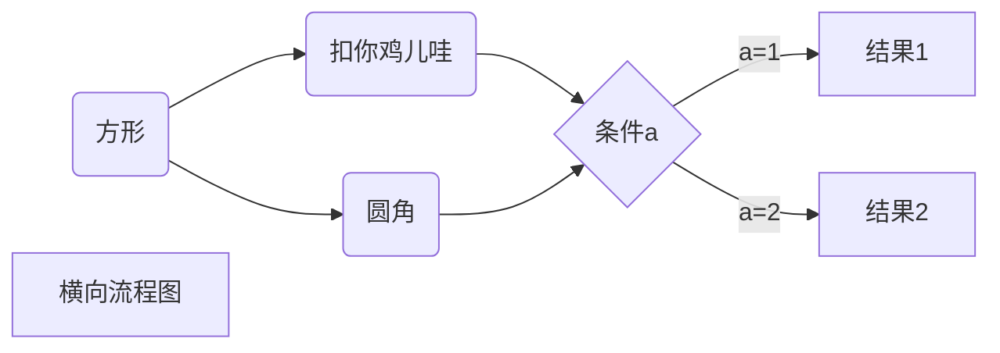
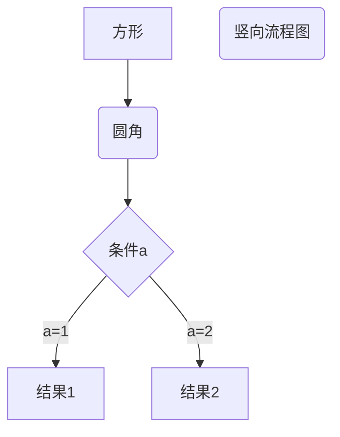
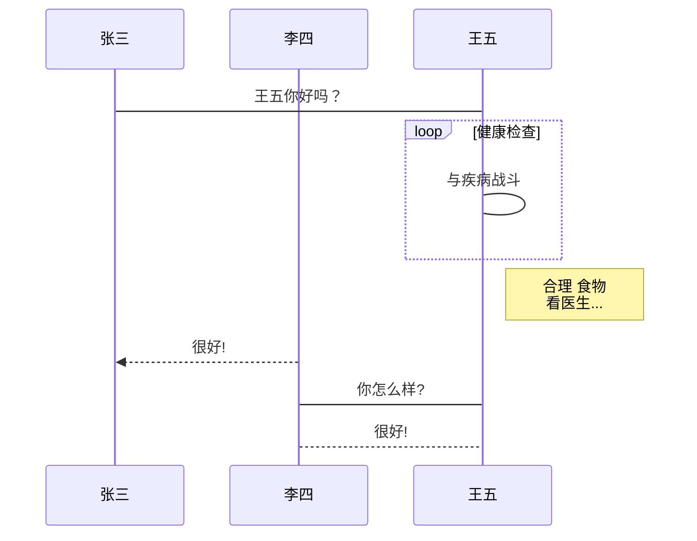
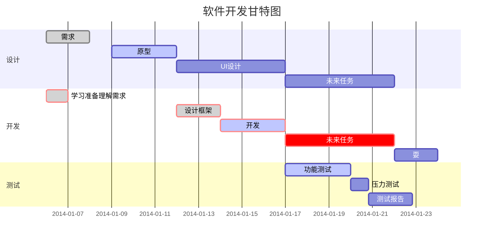

# Helloword，Markdown!

###  我是Markdown学习笔记

## **不同类标题**

# 一级标题

## 二级标题

### 三级标题


#### 四级标题

##### 五级标题

###### 六级


## **段落使用**

###### 段落居中的html代码

<center>段落html使用</center>>

我是第一段  

我是第二段  

我是第三段


## **不同类字体的示例**

*斜体文字*

_斜体文字_

**粗体文字**

__粗体文本__

***粗斜体文本***

___粗斜体文本___


## ***使用各种线***

### 分割线建立

---

***

*****

--------------------------------------

### 添加删除线

~~我是被删除的线~~

<u>我是html下划线</u>

脚注的寄主[^我是大脚注释属于亮爷的大脚注]

## 我是Markdown列表

### ***无序列表***

* 第一点，我很帅
* 第二点，我还是很帅
* 第三点，我真的很帅
  + 加号我们帅
    - 减号

- ✳号我们帅

1. 第一点我很帅

2. 我真的很帅

3. 我再次强调我很帅

   

### ***列表嵌套***

1. 第一项我就三点说明我很帅
   * 我头型帅
   * 我都眼睛帅
2. 第二项
   * 给你一坨镜子
   * 你是大傻吊


### **区块引用**

> 区块引用
>
> >区块二号
> >
> >> 区块下一个，嵌套
> >
> >

### ***区块中引用列表示例***

> 数据结构

> 1. 顺序表
> 2. 线性表
> 3. 动态链表
>    + 头指针
>    + 尾指针为NULL
> 4. 静态链表


### ***列表中引用区块示例***

* 第一项

> 啊~，五环

* 第二项

> 啊~六环


### ***代码的引用***/*存疑*/

`print(A)`这是python

​	< ?php

echo 'RUNOOB'

function test(){

echo 'test';

}

~~~javascript
``` javascript
$(document).ready(function () {
    alert('RUNOOB');
});
```
~~~

··· python

print（A）

···

### 链接的使用

这是我的私密网站[好地方][www.baidu.com]

这个链接使用1作为变量[Google][1]

这是个色色的2链接变量[小黄网][2]

[1]:www.google.com
[2]: www.yellow.com

### **图片的使用说明**

* 开头一个感叹号
* 接着一个方括号，放上替代文字
* 接着一个普通括号，里面放上图片的网址，最后还可以用引号包住并且加上选择性的title

```


```


![fuck 图标][11]

[]:
[11]:C:\Users\jojo\Desktop\C语言以及数据结构学习\Markdown学习\使用图片markdown.jpg


### **Markdown表格的使用**/*依然出问题*/

|表格1号|表格2号|

|----|----|

|单元格|单元格|

|单元格|单元格|

### **Markdown高级技巧**

##### 支持html元素

+ 使用<kbd><b><i><em><sup><sub><br>
+ 如果需要输入保留字符串 \****
  + Markdown 支持以下符号前面反斜杠帮助插入普通的符号
    1. \反斜线
    2. ·反引号
    3. *星号
    4. _下划线
    5. {}花括号
    6. []方括号
    7. ()小括号
    8. #井字号
    9. +
    10. -
    11. *
    12. /
    13. .
    14. ！

### ***Markdown高级技巧***





```flow
st=>start: 开始框
op=>operation: 处理框
cond=>condition: 判断框(是或否?)
sub1=>subroutine: 子流程
io=>inputoutput: 输入输出框
e=>end: 结束框
st->op->cond
cond(yes)->io->e
cond(no)->sub1(right)->op
```


```flow
st=>start: 开始框
op=>operation: 处理框
cond=>condition: 判断框(是或否?)
sub1=>subroutine: 子流程
io=>inputoutput: 输入输出框
e=>end: 结束框
st(right)->op(right)->cond
cond(yes)->io(bottom)->e
cond(no)->sub1(right)->op
```

```sequence
对象A->对象B: 对象B你好吗?（请求）
Note right of 对象B: 对象B的描述
Note left of 对象A: 对象A的描述(提示)
对象B-->对象A: 我很好(响应)
对象A->对象B: 你真的好吗？
```
```sequence
Title: 标题：复杂使用
对象A->对象B: 对象B你好吗?（请求）
Note right of 对象B: 对象B的描述
Note left of 对象A: 对象A的描述(提示)
对象B-->对象A: 我很好(响应)
对象B->小三: 你好吗
小三-->>对象A: 对象B找我了
对象A->对象B: 你真的好吗？
Note over 小三,对象B: 我们是朋友
participant C
Note right of C: 没人陪我玩
```


